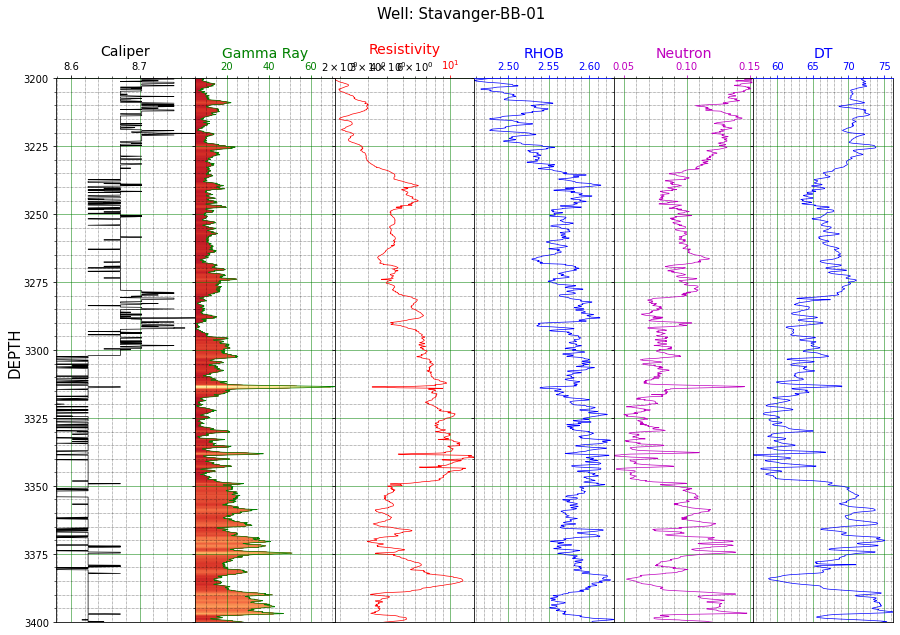
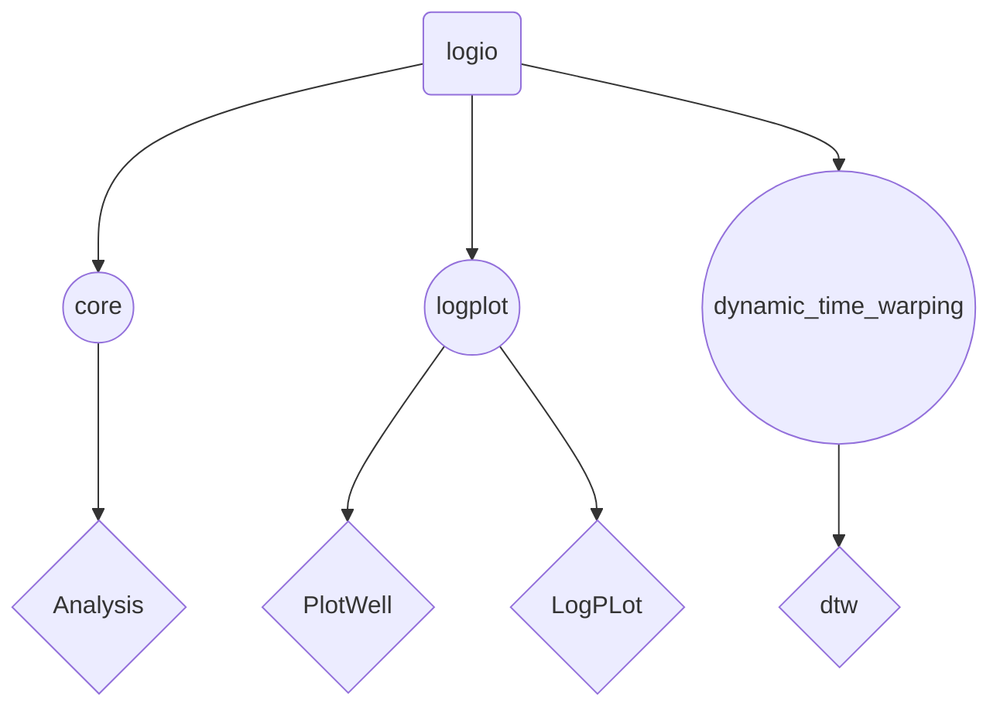
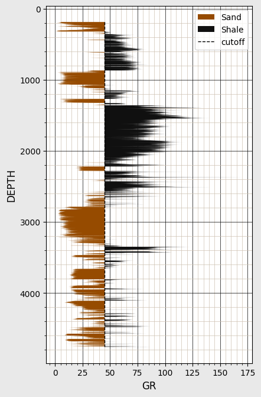

[](https://python.org)
[](https://lasio.readthedocs.io/en/latest/)


# Logio
**Society of Petroleum Engineers, University of Ibadan Chapter**  
    *Submission for the SPE Lagos Section Hackathon*

Python package for well log analysis and visualization. 
Also, this package is an Unsupervised Machine learning framework for well-well depth correlation using logs.




> [LAS Files](#las-files)  
> [Features](#features)  
> [Dependencies](#dependencies)  
> [Documentation](#documentation)  
> [Installation](#installation)  
> [Getting Started](#getting-started)  
> [Credits and References](#credits-and-references)  
> [Contributing](#contributing)  
> [Support](#support)  
> [Authors](#authors)  
---

### LAS Files

**LAS**, short for Log ASCII Standard (LAS) files, are generated in borehole operations such as geophysical, geological, or petrophysical logs. file contains  
Well log data saved in LAS file generally contains information, including its file **version**, **well description**, **physical rock curve** along with **data table** and **other information** related to the well data typically used in well log analysis. 

---

### Features

Here are a few things this package does well:

* Loads LAS data from various sources:
    - URL link (`https://example.com/.../.../path/to/lasfile.LAS`)
    - Local file (`path/to/lasfile.LAS` instead without `https`)
* Robust IO framework for loading data from flat files (CSV and delimited), Excel files, las files and JSON.
* Parsing well log data into any of the formats mentioned above.
* Hardcoded and flexible implementations for visualization of well logs and non-well log data, but in log format
* A novel system for well-to-well log correlation using dynamic depth warping techniques.
    - correlating well logs and obtaining the minimum-cost or "best" match.
---

### Dependencies

This project uses **Python 3** with dependencies provided in **[requirements.txt](requirements.txt)**. 

---

### Documentation

See the [Tutorials](./Tutorial) to explore the framework step-by-step in jupyter notebooks
and the [documentation](https://logio.readthedocs.io/en/latest/) for more details.

---

### Installation

Clone this repository using this command below on Terminal (Linux or Mac) or <a href="https://en.wikipedia.org/wiki/Windows_Subsystem_for_Linux" target="_blank"><abbr title="Windows Subsystem for Linux">WSL</abbr></a> (Windows).
```sh
git clone https://gitlab.com/aifenaike/Logio.git
cd Logio
```

Python environment setup is recommended for using this project repository.  

You can [create the environment variable manually](https://docs.python.org/3/library/venv.html) by typing the commands below on Linux or MacOS (and also WSL console).

```sh
python -m venv venv
source venv/bin/activate
```
and for Windows.
```
python -m venv venv
venv/Scripts/activate
```

You can now proceed to install required packages by running
```sh
pip install -r requirements.txt
```
---

### Getting Started



Example Session:
Load and plot a well log from ```.las``` file
```python
# Import the packages
>>> from logio.core import Analysis
>>> from logio.logplot import PlotWell, LogPlot

# Read in your data from a .las file
>>> data = Analysis().read_file(filename="data/15_9-F-11B.LAS")

# Plot a GR log with a cutoff delineating shale from sand volumes
LogPlot(data).cutoff_plot(x="GR", y="DEPTH", x_cutoff=0.45,  y_range= (0,0),xscale='linear',labels= ['Sand', 'Shale'], 
                          fig_size = (4.5, 7),colors=['#964B00','#101010']) 
```




---

### Credits and References

 - [**Schlumberger** Log Interpretation Principles\Applications](https://www.slb.com/resource-library/book/log-interpretation-principles-applications)
 - [**lasio**](https://github.com/kinverarity1/lasio)
 - [**Computing and Visualizing Dynamic Time Warping Alignments in R: The dtw Package**](https://cran.r-project.org/web/packages/dtw/vignettes/dtw.pdf)
 
---

## Contributing

Please see [`CONTRIBUTING.md`](CONTRIBUTING.md).

---

### Support

For support, email alexander.ifenaike@gmail.com

---

### Authors

Please see [`AUTHORS.md`](AUTHORS.md).

[back to top](#logio)


```python

```
